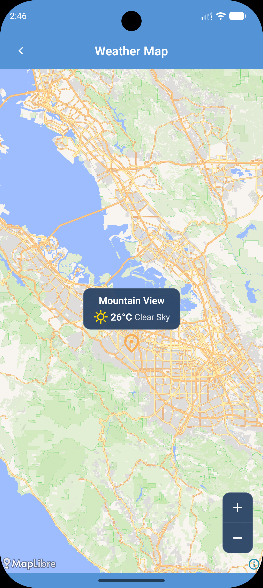

# Expo Weather App

> **Repository note:** [GitHub](https://github.com/alvinyanson/expo-weather) is the primary repository (used for GitHub Actions CI/CD). The GitLab repository is a mirror.

A React Native weather app I've been working on. It lets you check current conditions, view an 8-day forecast, and browse locations on an interactive map, with saved locations synced across devices via Firestore. It works offline, sends opt-in push notifications, and is battery-aware, throttling background refresh on low power. Firebase handles authentication (Google or anonymous).

_Note: I regularly update this app with new features, and I'll make sure this README stays up-to-date too._

## Screenshots

|                                         Home                                         |                                          Details                                           |                                         Authentication                                         |                                           Settings                                           |                                        Map                                         |
| :----------------------------------------------------------------------------------: | :----------------------------------------------------------------------------------------: | :--------------------------------------------------------------------------------------------: | :------------------------------------------------------------------------------------------: | :--------------------------------------------------------------------------------: |
| &nbsp;&nbsp;&nbsp;&nbsp; | &nbsp;&nbsp;&nbsp;&nbsp; | &nbsp;&nbsp;&nbsp;&nbsp; | &nbsp;&nbsp;&nbsp;&nbsp; | &nbsp;&nbsp;&nbsp;&nbsp; |

## Features

- **Current Weather & Forecasts**: View the latest conditions, an 8-day forecast, and hourly breakdowns.
- **Location Search & Geocoding**: Search for cities worldwide and instantly view their weather.
- **Interactive Weather Map**: Browse current-location and saved-location markers on a MapLibre map, with pinch/button zoom and quick navigation into a location's details.
- **Saved Locations & Sync**: Save your favorite cities, with instant Firestore synchronization across devices.
- **Push Notifications & Sync**: Opt-in to receive weather updates. Syncs push tokens and GPS coordinates automatically in the background.
- **Battery-Aware Refresh**: Detects low battery/low-power mode and throttles background refresh behavior to save power (toggleable in Settings).
- **Barometric Pressure**: Reads live atmospheric pressure from the device barometer, where available, and falls back gracefully on devices without the sensor.
- **Share & Copy**: Share a weather summary via the native share sheet, or copy a location's coordinates to the clipboard.
- **Haptic Feedback**: Tactile feedback on key interactions, toggleable in Settings.
- **Localization (i18n)**: Fully translated support for English and Japanese locales with system-default detection.
- **Accessibility (a11y)**: Fully optimized for screen readers with accessibility roles, labels, and gesture fallbacks (e.g. for swipe-to-delete).
- **Offline Caching**: View previously loaded weather data even without an active internet connection.
- **Authentication**: Seamlessly log in with Google or use an anonymous account, powered by Firebase.
- **Customizable Preferences**: Toggle between temperature units (°C/°F), wind units (km/h / mph), languages, haptics, and battery-aware refresh.
- **Pull-to-Refresh**: Easily fetch the most up-to-date weather data.
- **Telemetry & Error Logging**: Uncaught exceptions are automatically captured and reported via Firebase Crashlytics, alongside user-friendly error boundaries.

## Tech Stack

- **Framework**: [React Native](https://reactnative.dev) & [Expo](https://expo.dev/) (SDK 56)
- **Routing**: [Expo Router](https://docs.expo.dev/router/introduction/) (file-based)
- **Data Fetching & Caching**: [TanStack Query](https://tanstack.com/query/v5) with Offline Persister
- **State Management**: [Zustand](https://zustand-demo.pmnd.rs/)
- **Storage**: AsyncStorage and SecureStore (for sensitive cached coordinates)
- **Authentication**: Firebase (Google Sign-In & Anonymous Auth)
- **Database**: Firebase Firestore (saved locations & push token sync)
- **Maps**: [MapLibre](https://github.com/maplibre/maplibre-react-native) (`@maplibre/maplibre-react-native`)
- **Device Sensors & Hardware**: `expo-battery`, `expo-sensors` (barometer), `expo-location`, `expo-haptics`, `expo-clipboard`
- **Localization**: `i18n-js` and `expo-localization` (English and Japanese support)
- **Error Tracking**: Firebase Crashlytics
- **API**: [Open-Meteo](https://open-meteo.com/) for accurate, free weather data
- **Testing**: [Vitest](https://vitest.dev/) (unit/component) and [Maestro](https://maestro.mobile.dev/) (E2E flows)
- **Linting & Formatting**: [Oxlint](https://oxc.rs/docs/guide/usage/linter.html) and Prettier

## Getting Started

### Prerequisites

Ensure you have [Node.js](https://nodejs.org/) and [pnpm](https://pnpm.io/) installed. You'll also need an emulator or physical device for testing.

### Installation

1. Clone the repository and navigate into the project directory.

2. Install the dependencies:
   ```bash
   pnpm install
   ```

### Running the App

Start the Expo development server:

```bash
pnpm start
```

In the terminal output, you can press:

- `a` to open on an Android emulator.
- `i` to open on an iOS simulator.

_Note: This application requires native modules (e.g. Firebase) and does not support Expo Go. You must use a development build or run via native projects._

Alternatively, you can build and run directly via native projects:

```bash
pnpm run android
pnpm run ios
```

## Available Scripts

- **`pnpm start`**: Starts the Expo development server.
- **`pnpm run android`**: Compiles and runs the app on an Android device/emulator.
- **`pnpm run ios`**: Compiles and runs the app on an iOS simulator.
- **`pnpm test`**: Runs the test suite using Vitest.
- **`pnpm run test:watch`**: Runs the tests in watch mode.
- **`pnpm run lint`**: Lints the codebase with Oxlint.
- **`pnpm run lint:fix`**: Automatically fixes linting issues.
- **`pnpm run format`**: Formats the code using Prettier.
