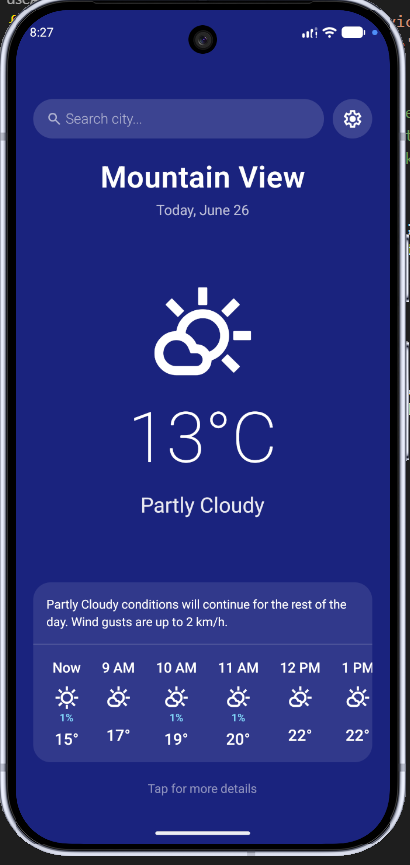
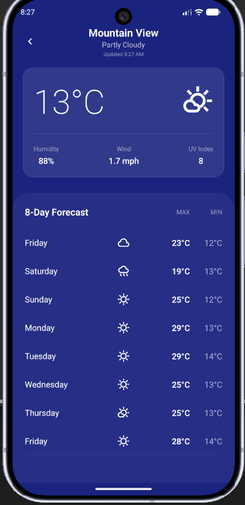
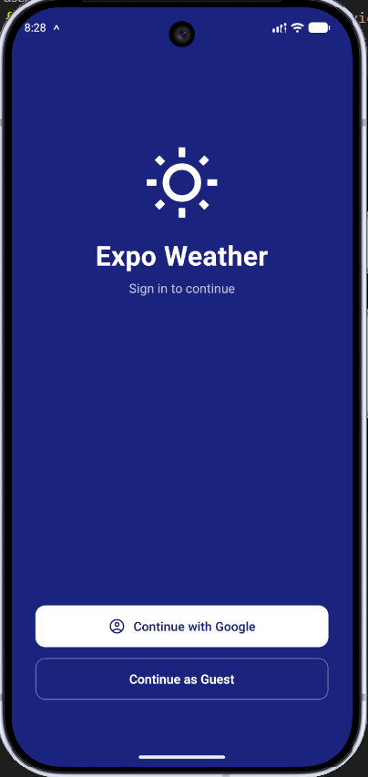
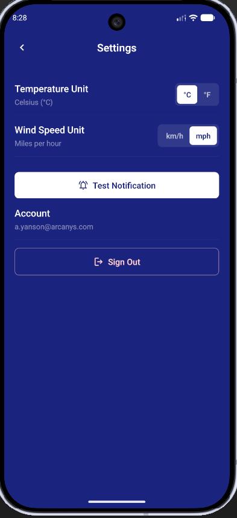
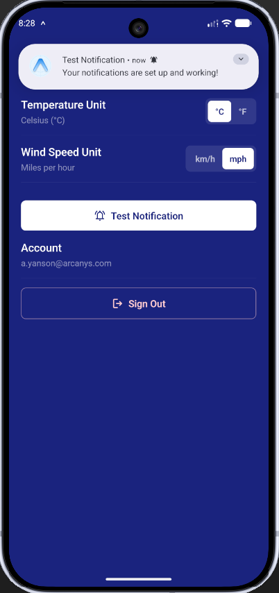

# Expo Weather App

A React Native weather app I've been working on. It lets you check current conditions, view an 8-day forecast, and save your favorite locations. I've also baked in offline support so it works without a connection, plus Firebase authentication to keep your settings synced.

_Note: I regularly update this app with new features, and I'll make sure this README stays up-to-date too._

## Screenshots

|                                         Home                                         |                                          Details                                           |                                         Authentication                                         |                                           Settings                                           |                                             Notifications                                              |
| :----------------------------------------------------------------------------------: | :----------------------------------------------------------------------------------------: | :--------------------------------------------------------------------------------------------: | :------------------------------------------------------------------------------------------: | :----------------------------------------------------------------------------------------------------: |
| &nbsp;&nbsp;&nbsp;&nbsp; | &nbsp;&nbsp;&nbsp;&nbsp; | &nbsp;&nbsp;&nbsp;&nbsp; | &nbsp;&nbsp;&nbsp;&nbsp; | &nbsp;&nbsp;&nbsp;&nbsp; |

## Features

- **Current Weather & Forecasts**: View the latest conditions, an 8-day forecast, and hourly breakdowns.
- **Location Search & Geocoding**: Search for cities worldwide and instantly view their weather.
- **Saved Locations**: Pin your favorite cities for quick access.
- **Offline Caching**: View previously loaded weather data even without an active internet connection.
- **Authentication**: Seamlessly log in with Google or use an anonymous account, powered by Firebase.
- **Customizable Preferences**: Toggle between temperature units (°C/°F).
- **Pull-to-Refresh**: Easily fetch the most up-to-date weather data.
- **Error Handling**: Graceful degradation and user-friendly error boundaries.

## Tech Stack

- **Framework**: [React Native](https://reactnative.dev) & [Expo](https://expo.dev/)
- **Data Fetching & Caching**: [TanStack Query](https://tanstack.com/query/v5) with Offline Persister
- **State Management**: [Zustand](https://zustand-demo.pmnd.rs/)
- **Storage**: AsyncStorage
- **Authentication**: Firebase (Google Sign-In & Anonymous Auth)
- **API**: [Open-Meteo](https://open-meteo.com/) for accurate, free weather data
- **Testing**: [Vitest](https://vitest.dev/)
- **Linting & Formatting**: [Oxlint](https://oxc.rs/docs/guide/usage/linter.html) and Prettier

## Getting Started

### Prerequisites

Ensure you have [Node.js](https://nodejs.org/) and [pnpm](https://pnpm.io/) installed. You'll also need an emulator or physical device for testing.

### Installation

1. Clone the repository and navigate into the project directory.

2. Install the dependencies:
   ```bash
   pnpm install
   ```

### Running the App

Start the Expo development server:

```bash
pnpm start
```

In the terminal output, you can press:

- `a` to open on an Android emulator.
- `i` to open on an iOS simulator.

_Note: This application requires native modules (e.g. Firebase) and does not support Expo Go. You must use a development build or run via native projects._

Alternatively, you can build and run directly via native projects:

```bash
pnpm run android
pnpm run ios
```

## Available Scripts

- **`pnpm start`**: Starts the Expo development server.
- **`pnpm run android`**: Compiles and runs the app on an Android device/emulator.
- **`pnpm run ios`**: Compiles and runs the app on an iOS simulator.
- **`pnpm test`**: Runs the test suite using Vitest.
- **`pnpm run test:watch`**: Runs the tests in watch mode.
- **`pnpm run lint`**: Lints the codebase with Oxlint.
- **`pnpm run lint:fix`**: Automatically fixes linting issues.
- **`pnpm run format`**: Formats the code using Prettier.
