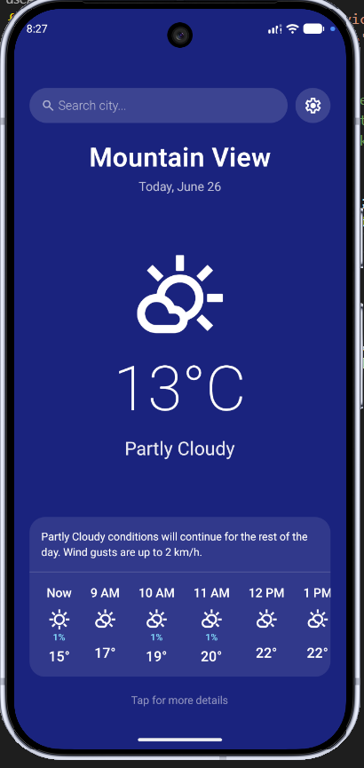
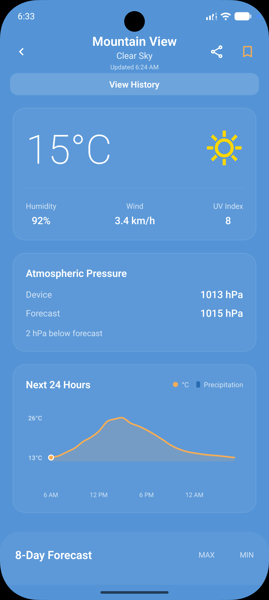
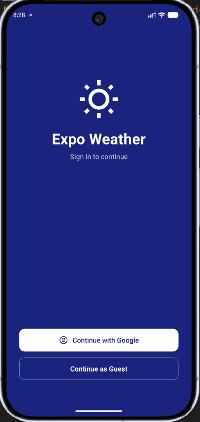
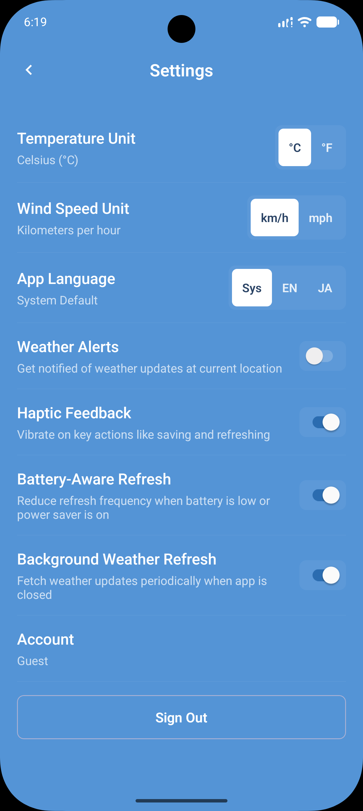
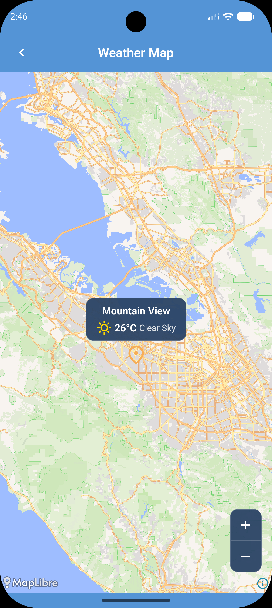

# Expo Weather App

> **Repository note:** [GitHub](https://github.com/alvinyanson/expo-weather) is the primary repository (used for GitHub Actions CI/CD). The GitLab repository is a mirror.

A React Native weather app I've been working on. It lets you check current conditions, view interactive 24-hour temperature charts and 8-day forecasts, browse locations on an interactive map, and manage saved locations with drag-and-drop reordering, with Firestore cloud sync across devices. It logs local weather history to SQLite, features a guided onboarding flow, works offline, sends opt-in push notifications with background refresh, and is battery-aware. Firebase handles authentication (Google or anonymous).

_Note: I regularly update this app with new features, and I'll make sure this README stays up-to-date too._

## Screenshots

|                                         Home                                         |                                          Details                                           |                                         Authentication                                         |                                           Settings                                           |                                        Map                                         |
| :----------------------------------------------------------------------------------: | :----------------------------------------------------------------------------------------: | :--------------------------------------------------------------------------------------------: | :------------------------------------------------------------------------------------------: | :--------------------------------------------------------------------------------: |
| &nbsp;&nbsp;&nbsp;&nbsp; | &nbsp;&nbsp;&nbsp;&nbsp; | &nbsp;&nbsp;&nbsp;&nbsp; | &nbsp;&nbsp;&nbsp;&nbsp; | &nbsp;&nbsp;&nbsp;&nbsp; |

## Features

- **Current Weather & Forecasts**: View latest conditions, an 8-day forecast, and detailed hourly breakdowns with WMO condition mapping.
- **Hourly Weather Charts**: Visual 24-hour temperature trend line and precipitation probability bar chart powered by React Native SVG.
- **Location Search & Geocoding**: Search for cities worldwide with instant auto-completion geocoding.
- **Interactive Weather Map**: Browse current-location and saved-location markers on a MapLibre map, with pinch/button zoom, custom marker selection, and seamless navigation to location details.
- **Saved Locations & Drag-and-Drop Reordering**: Save favorite cities with automatic Firestore synchronization across devices, reorder locations with drag-and-drop gestures, and confirm deletion via modal dialogs.
- **Historical Weather Logging**: Embedded SQLite database (`expo-sqlite`) to log and review daily weather summary records in a sectioned history view.
- **First-Time User Onboarding**: Multi-slide introductory onboarding carousel with smooth pagination indicators.
- **Push Notifications & Background Tasks**: Opt-in push weather notifications with background push token sync and periodic background fetch tasks managed by Expo TaskManager.
- **Battery-Aware Refresh**: Detects low battery/low-power mode via `expo-battery` and throttles background refresh behavior to conserve power (toggleable in Settings).
- **Barometric Pressure**: Reads live atmospheric pressure from the device barometer (`expo-sensors`), with intelligent fallbacks on unsupported hardware.
- **Share & Copy**: Share weather summaries via the native share sheet or copy location coordinates to the clipboard.
- **Haptic Feedback**: Tactile feedback on key UI interactions using `expo-haptics`, toggleable in Settings.
- **Localization (i18n)**: Fully translated support for English and Japanese locales with system-default detection.
- **Accessibility (a11y)**: Fully optimized for screen readers with explicit accessibility roles, labels, and gesture fallbacks.
- **Offline Caching & Network Status**: View cached weather data offline, powered by MMKV persistence and real-time connectivity status monitoring via NetInfo.
- **Authentication**: Seamlessly log in with Google or use an anonymous account via Firebase Auth.
- **Customizable Preferences**: Tailor app options for temperature units (°C/°F), wind speed units (km/h / mph), language, haptics, and power-saving refresh mode.
- **Pull-to-Refresh & Toast Feedback**: Pull-to-refresh weather updates and instant toast alerts via `react-native-toast-message`.
- **Telemetry & Error Logging**: Uncaught exceptions automatically reported via Firebase Crashlytics alongside fallback error boundaries.

## Tech Stack

- **Framework**: [React Native](https://reactnative.dev) & [Expo](https://expo.dev/) (SDK 56)
- **Routing**: [Expo Router](https://docs.expo.dev/router/introduction/) (file-based routing with typed routes)
- **Data Fetching & Caching**: [TanStack Query](https://tanstack.com/query/v5) (v5) with custom MMKV synchronous persister
- **State Management**: [Zustand](https://zustand-demo.pmnd.rs/) with MMKV persistence middleware
- **Storage**: Ultra-fast key-value storage using [MMKV](https://github.com/mrousavy/react-native-mmkv) (`react-native-mmkv`) and [Expo SecureStore](https://docs.expo.dev/versions/v56.0.0/sdk/securestore/)
- **Local Database**: [SQLite](https://docs.expo.dev/versions/v56.0.0/sdk/sqlite/) (`expo-sqlite`) for historical weather logs
- **Authentication**: Firebase Auth (`@react-native-firebase/auth` and `@react-native-google-signin/google-signin` for Google & Anonymous Auth)
- **Database & Cloud Sync**: Firebase Firestore (`@react-native-firebase/firestore` for saved locations & push token sync)
- **Maps**: [MapLibre](https://github.com/maplibre/maplibre-react-native) (`@maplibre/maplibre-react-native`)
- **UI & Animations**: [React Native SVG](https://github.com/software-mansion/react-native-svg) (hourly temperature & precipitation charts), [React Native Reanimated](https://docs.swmansion.com/react-native-reanimated/), [Gesture Handler](https://docs.swmansion.com/react-native-gesture-handler/), [Draggable FlatList](https://github.com/hannojg/react-native-draggable-flatlist), [Toast Message](https://github.com/calintamas/react-native-toast-message), `expo-symbols`, `expo-glass-effect`
- **Device Sensors & Hardware**: `expo-battery`, `expo-sensors` (barometer), `expo-location`, `expo-haptics`, `expo-clipboard`, `expo-device`
- **Background Tasks & Notifications**: `expo-background-task`, `expo-task-manager`, `expo-notifications`
- **Network Monitoring**: [`@react-native-community/netinfo`](https://github.com/react-native-netinfo/react-native-netinfo)
- **Localization**: `i18n-js` and `expo-localization` (English and Japanese support)
- **Error Tracking**: Firebase Crashlytics (`@react-native-firebase/crashlytics`)
- **API**: [Open-Meteo](https://open-meteo.com/) for accurate, free weather data & geocoding
- **Testing**: [Vitest](https://vitest.dev/) (unit/component) and [Maestro](https://maestro.mobile.dev/) (E2E flows)
- **Linting & Code Quality**: [Oxlint](https://oxc.rs/docs/guide/usage/linter.html), Prettier, Husky, and lint-staged

## Getting Started

### Prerequisites

Ensure you have [Node.js](https://nodejs.org/) and [pnpm](https://pnpm.io/) installed. You'll also need an emulator or physical device for testing.

### Installation

1. Clone the repository and navigate into the project directory.

2. Install the dependencies:
   ```bash
   pnpm install
   ```

### Running the App

Start the Expo development server:

```bash
pnpm start
```

In the terminal output, you can press:

- `a` to open on an Android emulator.
- `i` to open on an iOS simulator.

_Note: This application requires native modules (e.g. Firebase) and does not support Expo Go. You must use a development build or run via native projects._

Alternatively, you can build and run directly via native projects:

```bash
pnpm run android
pnpm run ios
```

## Available Scripts

- **`pnpm start`**: Starts the Expo development server.
- **`pnpm run android`**: Compiles and runs the app on an Android device/emulator.
- **`pnpm run ios`**: Compiles and runs the app on an iOS simulator.
- **`pnpm test`**: Runs the test suite using Vitest.
- **`pnpm run test:watch`**: Runs the tests in watch mode.
- **`pnpm run test:e2e`**: Runs end-to-end flow tests using Maestro.
- **`pnpm run lint`**: Lints the codebase with Oxlint.
- **`pnpm run lint:fix`**: Automatically fixes linting issues.
- **`pnpm run format`**: Formats the code using Prettier.
- **`pnpm run verify`**: Runs TypeScript type checking, Oxlint, and Vitest test suite.
